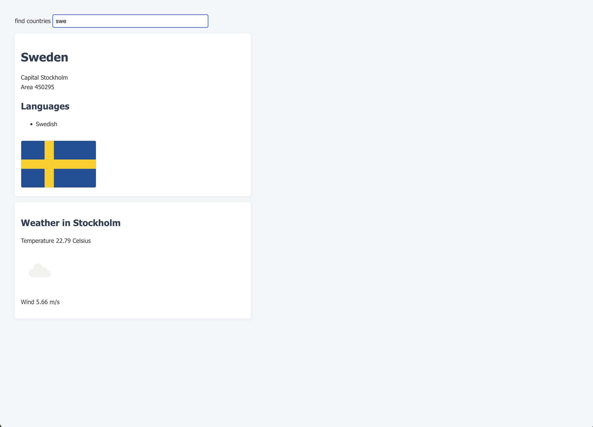

# 🌍 Countries App

A simple React app that allows users to search for countries and view detailed information including population, capital, languages, flag, and live weather in the capital city.

---

## 💡 Features

- 🔍 Filter countries by name (real-time search)
- 📋 View detailed country info (flag, capital, population, languages)
- 🌦️ Fetch current weather using a weather API (optional)
- 📱 Responsive design
- ⚙️ Uses public REST APIs (e.g., [restcountries.com](https://restcountries.com/))

---

## 🔧 Tech Stack

- React + Hooks (`useState`, `useEffect`)
- Axios for API requests
- Vite (for fast build & dev server)
- CSS for styling
- Modular components

---

## 📁 Project Structure

<pre>
<code>
📁 src/
├── App.jsx
├── App.css
├── components/
│   ├── Description.jsx
│   ├── Form.jsx
├── services/
│   └── countries.js
</code>
</pre>

---

## 🚀 Getting Started

1. **Clone the repository**

```bash
git clone https://github.com/ant-tur/countries-app.git
cd countries-app
```

2. **Install dependencies**

```bash
npm install
```

3. **Start the development server**

```bash
npm run dev
```

4. **(Optional) Deploy to GitHub Pages**

```bash
npm run deploy
```

---

## 🔗 Live Demo

👉 [View App on GitHub Pages](https://ant-tur.github.io/countries-app/)

---

## 🖼️ Screenshot



---

## 📜 License

MIT License — free to use, modify, and distribute.
